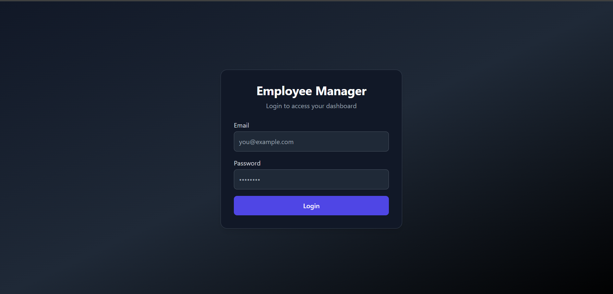
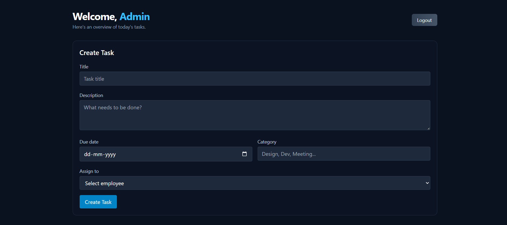
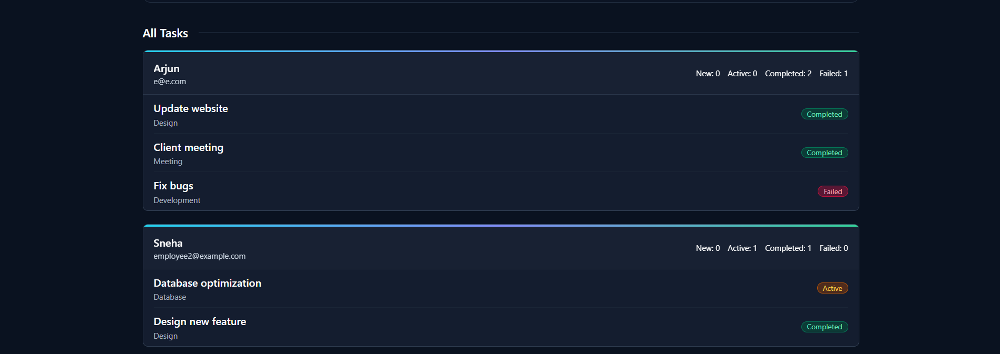
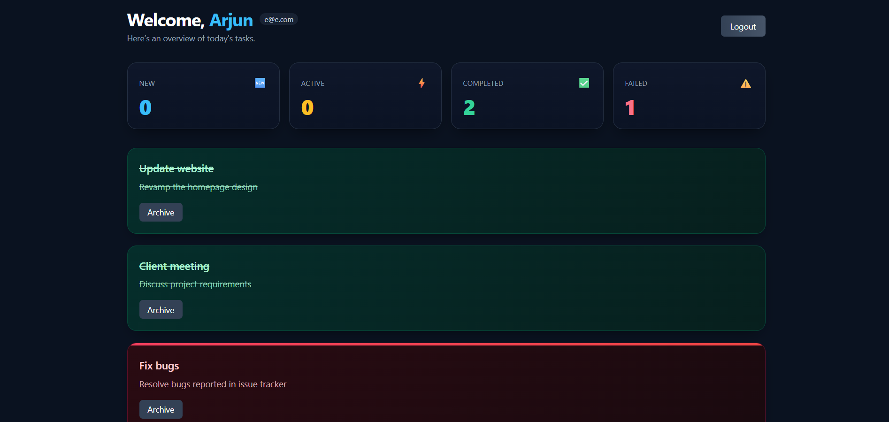

# 👨‍💼 Employee Management System

I built this **Employee Management System (EMS)** to practice React and strengthen my front-end development skills.  
It’s a lightweight dashboard where **Admins can assign tasks** and **Employees can manage them** with a clean UI and smooth workflow.  
All data persists in **localStorage** — no backend required.

---

## 🚀 Features
- **Admin Panel** — Create and assign tasks to employees.  
- **Employee Dashboard** — Accept, complete, fail, or archive tasks.  
- **Task Status Flow** — `New → Active → Completed/Failed → Archive`.  
- **Interactive UI** — Soft tinted task cards with hover effects and icons.  
- **Local Persistence** — Data survives page reloads.  

---

## 📸 Screenshots

  
  
  
  

---

## 🛠️ Technologies Used
- React + Vite  
- Tailwind CSS (for styling)  
- LocalStorage (for persistence)  

---

🔗 Live Demo
Check it out here: [Click here](https://sumit786-h.github.io/Employee-Management-System/
)

